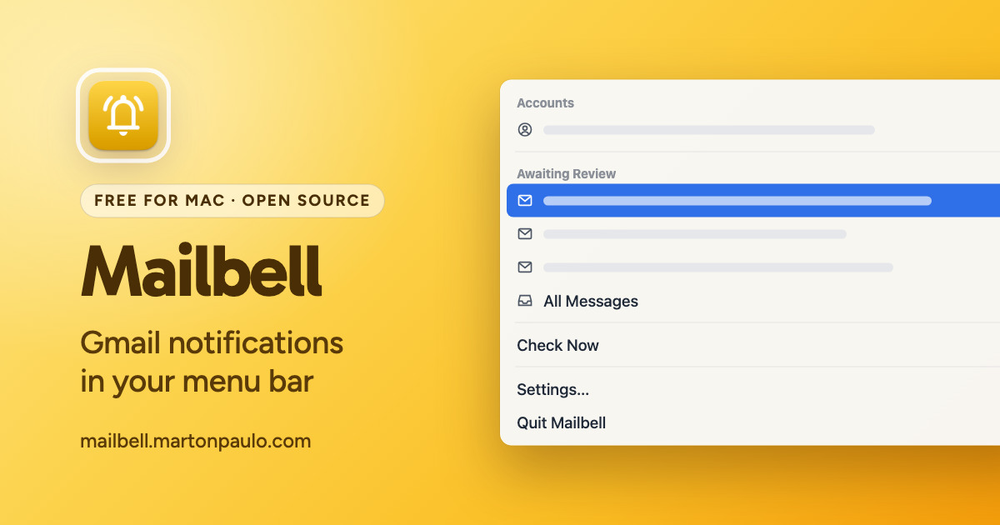

<div align="center">



# Mailbell

Gmail notifications in your macOS menu bar — instant IMAP IDLE alerts, a review queue you can clear in one click, no server in between.

[](https://github.com/martonpaulo/mailbell/actions/workflows/ci.yml) [](https://github.com/martonpaulo/mailbell/actions/workflows/release.yml) [](https://swift.org) [](https://sparkle-project.org)

</div>

You do not want Gmail open all day. You also do not want to find out about a message three hours
late. **Mailbell sits in your menu bar, tells you the moment mail arrives, and lets you clear the
whole queue in one click** — it holds an IMAP IDLE connection instead of polling on a timer, and a
Gmail thread counts once, not once per reply.

It runs **entirely on your Mac. There is no Mailbell server.** Tokens live in the macOS Keychain,
the only change it ever makes to your mailbox is marking a message read when you ask, and the only
network traffic outside Gmail itself is the update check through
[Sparkle](https://sparkle-project.org).

<br />

---

## 🌱 Quick Start

Requires **macOS 26 or later** and a current Xcode toolchain. Optional: `swiftlint` and `swiftformat`
for `make check`.

```bash
git clone https://github.com/martonpaulo/mailbell.git
cd mailbell
cp .env.example .env      # then set MAILBELL_GOOGLE_CLIENT_ID
make check                # build + lint + tests + repository invariants
make install              # ad-hoc signed bundle in /Applications
```

Local builds need your **own** Google Desktop OAuth client, because the release credentials are not
in this repository. Create one in the
[Google Cloud Console](https://console.cloud.google.com/apis/credentials) under *Create Credentials →
OAuth client ID → Desktop app*, with the Gmail API enabled and IMAP turned on in Gmail settings. The
client secret is optional for Desktop clients.

Install to `/Applications` rather than running the unbundled binary: macOS only delivers
notifications to a real app bundle.

## 🛠 Commands

`make` with no target lists everything. The ones that matter:

| Command | What it does |
|---|---|
| `make build` | Build debug artifacts |
| `make app` | Build the debug executable product |
| `make run` | Run the debug executable (unbundled; notifications need `make install`) |
| `make test` | Run the test suite |
| `make lint` | Run SwiftLint |
| `make format` | Format sources with SwiftFormat |
| `make validate` | Check the repository invariants (`Scripts/validate.sh`) |
| `make check` | `build` + `lint` + `test` + `validate` |
| `make install` | Install an ad-hoc signed app bundle to `/Applications` |
| `make uninstall` | Remove the installed app bundle |
| `make dmg` | Build an ad-hoc signed drag-and-drop DMG |
| `make icons` | Regenerate the AppIcon PNGs and `.icns` from `Resources/logo.png` |
| `make setup-release-signing` | Configure the Developer ID identity and the `notarytool` Keychain profile |
| `make sparkle-keys` | Generate the Sparkle EdDSA key into the Keychain |
| `make release` | Build, sign, notarize and staple a tagged release DMG |
| `make clean` | Remove SwiftPM build artifacts |

## 🔐 Secrets and variables

Never commit `.env`, credentials, tokens, or signing material. The names below are the complete set;
the values live in your shell, the Keychain, or GitHub Actions secrets.

Local environment ([.env.example](.env.example)):

| Name | What it is |
|---|---|
| `MAILBELL_GOOGLE_CLIENT_ID` | Your own Google Desktop OAuth client ID. Required for a local build |
| `MAILBELL_GOOGLE_CLIENT_SECRET` | That client's secret. Optional for Desktop clients |
| `MAILBELL_BUNDLE_ID` | Optional. May only restate the identifier already in `Resources/Info.plist`; packaging rejects a different value |
| `MAILBELL_CODE_SIGN_IDENTITY` | Signing identity label for a signed local build |
| `MAILBELL_NOTARY_KEYCHAIN_PROFILE` | Name of an existing `notarytool` Keychain profile |

GitHub Actions secrets, read by [`.github/workflows/release.yml`](.github/workflows/release.yml).
The workflow checks all seven up front and **skips the release cleanly** when any is missing, rather
than publishing an unsigned or credential-less build:

| Secret | What it is |
|---|---|
| `DEVELOPER_ID_CERT_P12` | base64 of a PKCS#12 holding **only** the Developer ID Application identity |
| `DEVELOPER_ID_CERT_PASSWORD` | That PKCS#12's export password |
| `NOTARIZATION_APPLE_ID` | Apple Developer account email |
| `NOTARIZATION_PASSWORD` | App-specific password for notarization |
| `NOTARIZATION_TEAM_ID` | Apple Developer Team ID |
| `SPARKLE_PRIVATE_KEY` | Sparkle EdDSA private key (`generate_keys -x`) |
| `MAILBELL_GOOGLE_CLIENT_ID` / `MAILBELL_GOOGLE_CLIENT_SECRET` | The release OAuth client |

> **Exporting the certificate:** `security export -t identities` dumps *every* identity in the login
> keychain, which on a normal Mac includes unrelated personal certificates such as government eID
> keys. Narrow the export to the single Developer ID identity before it goes anywhere near a secret
> store.

`ci.yml` and `pages.yml` read no secrets at all.

## Public beta: Google has not verified this app yet

Mailbell's Google OAuth client has **not been submitted for Google's review yet**, so it is an
**unverified app**. Before you install, know both consequences:

- **You will see a warning screen during sign-in.** Google shows *"Google hasn't verified this
  app"*. You have to choose **Advanced**, then continue. This is expected, and it goes away once
  verification completes.
- **Google caps unverified apps at 100 new users.** Once 100 people have connected an account, new
  sign-ins stop working until verification completes. **No unlimited use is promised while the app
  is unverified.**

This is a review status, not a security problem. Your Gmail data still never passes through any
server this project operates, because none exists.

If your account belongs to a Google Workspace organization, your administrator may block unverified
apps entirely. That is their policy to change, not something the app can work around.

## What it does

| | |
|---|---|
| 🔔 **Instant, not polled** | Holds an IMAP IDLE connection, so mail shows up when it arrives instead of on a timer |
| 📨 **A review queue** | Sender, time, and a short preview in the menu. A Gmail thread counts once, not once per reply |
| ✅ **Mark All as Read** | Clears the queue *and* marks everything read in Gmail, over one authenticated session per account |
| 🧹 **Dismiss All** | Clears your queue and leaves Gmail untouched. Dismissed mail stays unread and is kept out of the queue while its history record lasts |
| 🔄 **Gmail stays authoritative** | Read something in Gmail and it leaves the queue. An item you opened but left unread can come back — Gmail, not Mailbell, decides what is still unread |
| ⚠️ **Honest menu bar icon** | When a sign-in expires, the bell becomes an alert icon and a notification tells you. Mailbell never looks idle while monitoring nothing |
| 🌐 **Opens in the right place** | Default browser, a specific browser, or the exact Chrome profile already signed in to that account |
| 🗑️ **Optional Spam** | Off by default; turn it on and unread Spam joins the queue |
| 🚀 **Start at login** | Set it once, forget it |

## What Mailbell can see

Mailbell connects straight from your Mac to Gmail over IMAP. It reads only what a notification needs:

- the address of the account you connected
- sender, subject, and sent date
- Gmail and IMAP identifiers, to avoid duplicates and group threads
- read/unread state
- a **bounded** text preview, capped at roughly 8 KB and fetched read-only

**It never fetches attachments or full message bodies.** The only change it ever makes to your
mailbox is marking a message read, and only when you ask.

Tokens live in the **macOS Keychain**. There is no analytics, no telemetry, and no advertising, and
your data is never sold, shared, or used to train AI.

### About the scope Google asks for

| Scope | Why |
|---|---|
| `https://mail.google.com/` | Required for Gmail IMAP XOAUTH2 and the server-side mark-as-read command. Narrower Gmail API scopes do not authenticate the IMAP transport |
| `openid` | The OpenID Connect user-info call after sign-in |
| `email` | Reads the signed-in address so IMAP can authenticate as that user |

Gmail offers no narrower scope that permits IMAP, so the consent screen describes wider access than
the app uses. That is worth stating plainly rather than hiding: what it actually does is the list
above, and the source is here.

**Revoking access:** remove the account in Settings → Accounts (this deletes the local tokens), then
revoke at your [Google Account permissions page](https://myaccount.google.com/permissions).

References:
[OAuth for desktop apps](https://developers.google.com/identity/protocols/oauth2/native-app) ·
[Gmail XOAUTH2](https://developers.google.com/workspace/gmail/imap/xoauth2-protocol) ·
[Gmail scopes](https://developers.google.com/workspace/gmail/api/auth/scopes)

## Settings

Four native panes: **General** (menu bar count, start at login, Restore Defaults, updates),
**Notifications** (permission state and a test notification), **Accounts** (connect, status,
reconnect, remove, Spam and per-account browser routing), and **About**.

Every default and the reasoning behind it is in
[docs/feature-defaults.md](docs/feature-defaults.md).

## Releasing (maintainers)

One-time on the release Mac:

```bash
make setup-release-signing   # Developer ID identity + notarytool Keychain profile
make sparkle-keys            # Sparkle EdDSA key into the login Keychain
```

Per release: bump `CFBundleShortVersionString` in `Resources/Info.plist`, add a `CHANGELOG.md`
entry, commit, then

```bash
git tag v0.1.0 && make release
```

`make release` refuses a dirty worktree, a tag that disagrees with the plist version, or a build
number that disagrees with the derived one. It builds, signs with Developer ID, notarizes and
staples both the app archive and the DMG, signs the update for Sparkle, and writes the `appcast.xml`
entry. Commit the appcast, push the tag, and attach the DMG and ZIP to the GitHub Release.

Pushing a `v*.*.*` tag runs the same flow in CI, using the secrets above. `workflow_dispatch` reruns
the whole signing chain against an existing tag, so the pipeline can be exercised without inventing
a version.

Docs: [architecture](docs/architecture.md) · [feature defaults](docs/feature-defaults.md) ·
[contributing](CONTRIBUTING.md) · [security](SECURITY.md) · [agent policy](AGENTS.md)

## Troubleshooting

- **No notifications** — macOS only delivers notifications to a real app bundle. Install to
  `/Applications` instead of running the copy inside the DMG, and check Settings → Notifications.
- **The menu bar shows an alert triangle** — an account needs you. Open Settings → Accounts and use
  *Sign in Again* or *Reconnect*.
- **Sign-in fails immediately** — IMAP must be enabled in
  [Gmail settings](https://mail.google.com/mail/u/0/#settings/fwdandpop), and a Workspace
  administrator may be blocking unverified apps.
- **"This build is missing its Google OAuth configuration"** — the build was packaged without
  credentials. If you downloaded it from Releases, please
  [report it](https://github.com/martonpaulo/mailbell/issues).
- **Sign-in stopped working for new people** — the 100-user cap for unverified apps may have been
  reached.

## Limitations

- **Gmail only**, over IMAP IDLE. No other provider, and no polling fallback.
- **macOS 26 or later only.** There is no iOS companion.
- **Notification-shaped, not a mail client.** No reply, compose, archive, delete, labels, or move;
  no attachments and no full message bodies.
- **No backend, relay, or sync.** Accounts and settings live on the Mac you added them on.
- The OAuth client is **unverified by Google**, so sign-in shows a warning screen and is capped at
  100 new users until review completes.
- Gmail exposes no narrower scope that permits IMAP, so the consent screen asks for more than the
  app uses.

## License

[MIT](LICENSE) © 2026 Marton Paulo.

Forked from [samzong/mailbell](https://github.com/samzong/mailbell).

Third-party notices in [ATTRIBUTIONS.md](ATTRIBUTIONS.md).
