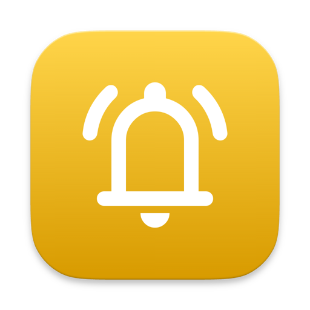

<div align="center">



# Mailbell

**Gmail notifications in your macOS menu bar.**

[](https://github.com/martonpaulo/mailbell/actions/workflows/ci.yml)
[](https://github.com/martonpaulo/mailbell/releases/latest)
[](#-install)
[](LICENSE)

**[Visit the Mailbell website](https://martonpaulo.github.io/mailbell/)**

</div>

You do not want Gmail open all day. You also do not want to find out about a
message three hours late. **Mailbell sits in your menu bar, tells you the moment
mail arrives, and lets you clear the whole queue in one click.**

It runs entirely on your Mac. There is no Mailbell server.

## ⚠️ Public beta: Google has not verified this app yet

Mailbell's Google OAuth client is still going through Google's review, so it is
an **unverified app**. Before you install, know both consequences:

- **You will see a warning screen during sign-in.** Google shows
  *"Google hasn't verified this app"*. You have to choose **Advanced**, then
  continue. This is expected, and it goes away once verification completes.
- **Google caps unverified apps at 100 new users.** Once 100 people have
  connected an account, new sign-ins stop working until verification completes.
  **No unlimited use is promised while the app is unverified.**

This is a review status, not a security problem. Your Gmail data still never
passes through any server this project operates, because none exists. See the
[Privacy Policy](https://martonpaulo.github.io/mailbell/privacy.html) and the
[Terms](https://martonpaulo.github.io/mailbell/terms.html).

If your account belongs to a Google Workspace organization, your administrator
may block unverified apps entirely. That is their policy to change, not
something the app can work around.

## ⚡ Install

**[Download the latest DMG →](https://github.com/martonpaulo/mailbell/releases/latest)**

1. Open the DMG and drag **Mailbell** to Applications. Releases are signed with
   an Apple Developer ID, notarized by Apple, and stapled.
2. Launch Mailbell from Applications and add your Gmail account. Sign-in happens
   in your own browser; Mailbell never sees your Google password.
3. Get past Google's unverified-app screen (**Advanced** → continue).
4. Allow notifications when macOS asks.

That is the whole setup. Mailbell keeps itself up to date through
[Sparkle](https://sparkle-project.org), verifying each update's signature before
replacing the app. Automatic checks can be turned off in Settings → Updates.

> Open source · direct download · macOS 26 or later

## ✨ What it does

| | |
|---|---|
| 🔔 **Instant, not polled** | Holds an IMAP IDLE connection, so mail shows up when it arrives instead of on a timer |
| 📨 **A review queue** | Sender, time, and a short preview in the menu. A Gmail thread counts once, not once per reply |
| ✅ **Mark All as Read** | Clears the queue *and* marks everything read in Gmail, over one authenticated session per account |
| 🧹 **Dismiss All** | Clears your queue and leaves Gmail untouched. Dismissed mail stays unread and does not come back |
| ⚠️ **Honest menu bar icon** | When a sign-in expires, the bell becomes an alert icon and a notification tells you. Mailbell never looks idle while monitoring nothing |
| 🌐 **Opens in the right place** | Default browser, a specific browser, or the exact Chrome profile already signed in to that account |
| 🗑️ **Optional Spam** | Off by default; turn it on and unread Spam joins the queue |
| 🚀 **Start at login** | Set it once, forget it |

## 🔒 What Mailbell can see

Mailbell connects straight from your Mac to Gmail over IMAP. It reads only what
a notification needs:

- the address of the account you connected
- sender, subject, and sent date
- Gmail and IMAP identifiers, to avoid duplicates and group threads
- read/unread state
- a **bounded** text preview, capped at roughly 8 KB and fetched read-only

**It never fetches attachments or full message bodies.** The only change it ever
makes to your mailbox is marking a message read, and only when you ask.

Tokens live in the **macOS Keychain**. There is no analytics, no telemetry, and
no advertising, and your data is never sold, shared, or used to train AI.

### About the scope Google asks for

| Scope | Why |
|---|---|
| `https://mail.google.com/` | Required for Gmail IMAP XOAUTH2 and the server-side mark-as-read command. Narrower Gmail API scopes do not authenticate the IMAP transport |
| `openid` | The OpenID Connect user-info call after sign-in |
| `email` | Reads the signed-in address so IMAP can authenticate as that user |

Gmail offers no narrower scope that permits IMAP, so the consent screen
describes wider access than the app uses. That is worth stating plainly rather
than hiding: what it actually does is the list above, and the source is here.

**Revoking access:** remove the account in Settings → Accounts (this deletes the
local tokens), then revoke at your
[Google Account permissions page](https://myaccount.google.com/permissions).

References:
[OAuth for desktop apps](https://developers.google.com/identity/protocols/oauth2/native-app) ·
[Gmail XOAUTH2](https://developers.google.com/workspace/gmail/imap/xoauth2-protocol) ·
[Gmail scopes](https://developers.google.com/workspace/gmail/api/auth/scopes)

## 🖼️ Settings

Six native panes: **General** (menu bar count, start at login, Restore
Defaults), **Notifications** (permission state and a test notification),
**Accounts** (connect, status, reconnect, remove), **Advanced** (Spam and
per-account browser routing), **Updates**, and **About**.

Every default and the reasoning behind it is in
[docs/feature-defaults.md](docs/feature-defaults.md).

## 🛠 Build from source

Requires macOS 26+ and a current Xcode toolchain. Optional: `swiftlint` and
`swiftformat` for `make check`.

```bash
make check
```

That runs the build (warning-free), SwiftLint, the tests, and repository
invariants. Other useful targets:

```bash
make install   # ad-hoc signed bundle in /Applications (needed to test notifications)
make dmg       # ad-hoc signed installer DMG
make run       # unbundled debug run
```

`make` with no target lists everything.

Local builds need your **own** Google Desktop OAuth client, because the release
credentials are not in this repository. Copy `.env.example` to `.env` and set
`MAILBELL_GOOGLE_CLIENT_ID`; the secret is optional for Desktop clients. Create
the client in the
[Google Cloud Console](https://console.cloud.google.com/apis/credentials) under
*Create Credentials → OAuth client ID → Desktop app*, with the Gmail API
enabled and IMAP turned on in Gmail settings.

Docs: [architecture](docs/architecture.md) ·
[feature defaults](docs/feature-defaults.md) ·
[contributing](CONTRIBUTING.md) · [security](SECURITY.md) ·
[agent policy](AGENTS.md)

## 📦 Releasing (maintainers)

One-time on the release Mac:

```bash
make setup-release-signing   # Developer ID identity + notarytool Keychain profile
make sparkle-keys            # Sparkle EdDSA key into the login Keychain
```

Per release: bump `CFBundleShortVersionString` in `Resources/Info.plist`, add a
`CHANGELOG.md` entry, commit, then

```bash
git tag v0.1.0 && make release
```

`make release` refuses a dirty worktree, a tag that disagrees with the plist
version, or a build number that disagrees with the derived one. It builds, signs
with Developer ID, notarizes and staples both the app archive and the DMG, signs
the update for Sparkle, and writes the `appcast.xml` entry. Commit the appcast,
push the tag, and attach the DMG and ZIP to the GitHub Release.

Pushing a `v*.*.*` tag runs the same flow in CI. It needs these repository
secrets, and skips the release cleanly if any are missing rather than failing:

| Secret | What it is |
|---|---|
| `DEVELOPER_ID_CERT_P12` | base64 of a PKCS#12 holding **only** the Developer ID Application identity |
| `DEVELOPER_ID_CERT_PASSWORD` | that PKCS#12's export password |
| `NOTARIZATION_APPLE_ID` | Apple Developer account email |
| `NOTARIZATION_PASSWORD` | app-specific password for notarization |
| `NOTARIZATION_TEAM_ID` | Apple Developer Team ID |
| `SPARKLE_PRIVATE_KEY` | Sparkle EdDSA private key (`generate_keys -x`) |
| `MAILBELL_GOOGLE_CLIENT_ID` / `MAILBELL_GOOGLE_CLIENT_SECRET` | the release OAuth client |

> **Exporting the certificate:** `security export -t identities` dumps *every*
> identity in the login keychain, which on a normal Mac includes unrelated
> personal certificates such as government eID keys. Narrow the export to the
> single Developer ID identity before it goes anywhere near a secret store.

`workflow_dispatch` reruns the whole signing chain against an existing tag, so
the pipeline can be exercised without inventing a version.

## 🐛 Troubleshooting

- **No notifications** — macOS only delivers notifications to a real app bundle.
  Install to `/Applications` instead of running the copy inside the DMG, and
  check Settings → Notifications.
- **The menu bar shows an alert triangle** — an account needs you. Open
  Settings → Accounts and use *Sign in Again* or *Reconnect*.
- **Sign-in fails immediately** — IMAP must be enabled in
  [Gmail settings](https://mail.google.com/mail/u/0/#settings/fwdandpop), and a
  Workspace administrator may be blocking unverified apps.
- **"This build is missing its Google OAuth configuration"** — the build was
  packaged without credentials. If you downloaded it from Releases, please
  [report it](https://github.com/martonpaulo/mailbell/issues).
- **Sign-in stopped working for new people** — the 100-user cap for unverified
  apps may have been reached.

## 📄 License

[MIT](LICENSE) © 2026 Marton Paulo, forked from
[samzong/mailbell](https://github.com/samzong/mailbell) · third-party notices in
[ATTRIBUTIONS.md](ATTRIBUTIONS.md)
