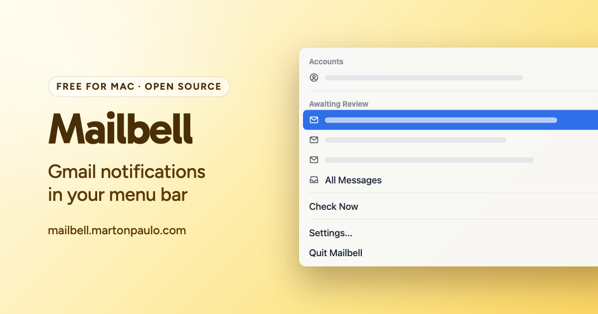

<div align="center">



# Mailbell

Gmail notifications in your macOS menu bar — instant IMAP IDLE alerts, a review queue you can clear in one click, no server in between.

[](https://github.com/martonpaulo/mailbell/actions/workflows/validate.yml) [](https://github.com/martonpaulo/mailbell/actions/workflows/deploy.yml) [](https://github.com/martonpaulo/mailbell/actions/workflows/release.yml)

[](https://swift.org) [](https://sparkle-project.org)

</div>

You do not want Gmail open all day. You also do not want to find out about a message three hours
late. **Mailbell sits in your menu bar, tells you the moment mail arrives, and lets you clear the
whole queue in one click** — it holds an IMAP IDLE connection instead of polling on a timer, and a
Gmail thread counts once, not once per reply.

It runs **entirely on your Mac. There is no Mailbell server.** Tokens live in the macOS Keychain,
the only change it ever makes to your mailbox is marking a message read when you ask, and the only
network traffic outside Gmail itself is the update check through
[Sparkle](https://sparkle-project.org).

---

<br />

## 🌱 Quick Start
Requires **macOS 26 or later** and the **Swift 6.2** toolchain; `make check` also uses SwiftLint and SwiftFormat.

```bash
git clone https://github.com/martonpaulo/mailbell.git
cd mailbell
cp .env.example .env      # then set MAILBELL_GOOGLE_CLIENT_ID
make install
```

Local builds need your **own** Google Desktop OAuth client, because the release credentials are not in this repository.

Install to `/Applications` rather than running the unbundled binary: macOS only delivers notifications to a real app bundle.

Every packaged build goes through `scripts/package-with-oauth.sh`: it writes the OAuth client into `Support/Info.plist` for one run of `scripts/package-app.sh` and restores the file afterwards. `make dmg` builds the disk image with appdmg, which needs **Node 24 or older** first on `PATH` (for example `nvm use 24`).

<br />

## 🛠 Commands
| Command | What it does |
| --- | --- |
| `make check` | Run the full gate before a commit: `build`, `lint`, `test`, `validate` |
| `make build` | Build the debug artifacts |
| `make app` | Package `build/Mailbell.app` and its update archive in `artifacts/`, ad-hoc signed unless `DEVELOPER_ID_IDENTITY` is set; `FORCE=1` replaces them |
| `make run` | Build and run the debug executable, unbundled; notifications need `make install` |
| `make test` | Run the test suite |
| `make lint` | Run SwiftLint |
| `make format` | Format the sources with SwiftFormat |
| `make validate` | Check the repository invariants (`scripts/validate.sh`) |
| `make install` | Copy `build/Mailbell.app` from `make app` into `/Applications` |
| `make uninstall` | Remove the installed app bundle |
| `make refresh-icons` | Reinstall and flush the macOS icon caches after an icon change |
| `make dmg` | Build the drag-and-drop DMG at `artifacts/Mailbell-<version>.dmg` from `make app`; needs Node 24 or older |
| `make icon` | Regenerate the app icon from `Support/logo.png` and the DMG background |
| `make screenshots` | Capture the site's Settings screenshots from a throwaway bundle |
| `make keys` | Once per machine: check the Sparkle key in the login Keychain against `SUPublicEDKey` |
| `make appcast` | Add one `appcast.xml` entry from `VERSION`, `BUILD_NUMBER`, `ARCHIVE` and `SIGNATURE`, for a rehearsal or a recovery |
| `make setup-release-signing` | Record `DEVELOPER_ID_IDENTITY` in `.env` and create the shared `skd-notary` Keychain profile |
| `make clean-test-defaults` | List the test preferences files older runs left in `~/Library/Preferences`; `DELETE=1` removes them |
| `make clean` | Remove the SwiftPM build, `build/` and `artifacts/` |

`make` with no target lists every target.

<br />

## 🔐 Secrets and variables
Names only: the values live in your shell, the Keychain, or the repository's Actions secrets, `validate.yml` and `deploy.yml` read none of them, and `notary-check.yml` only authenticates the three `NOTARY_API_*` secrets.

| Name | Where | What for |
| --- | --- | --- |
| `MAILBELL_GOOGLE_CLIENT_ID` | `.env` locally, Actions secret for a release | Required. The Google Desktop OAuth client ID the build signs in with |
| `DEVELOPER_ID_CERT_P12` | Actions secret, `release.yml` | Required for a release. Base64 of a PKCS#12 holding only the Developer ID Application identity |
| `DEVELOPER_ID_CERT_PASSWORD` | Actions secret, `release.yml` | Required for a release. That PKCS#12's export password |
| `NOTARY_API_KEY` | Actions secret, `release.yml` | Required for a release. The team App Store Connect API key (`.p8`, Developer role) used by `scripts/notarize.sh` |
| `NOTARY_API_KEY_ID` | Actions secret, `release.yml` | Required for a release. That key's Key ID |
| `NOTARY_API_ISSUER_ID` | Actions secret, `release.yml` | Required for a release. The App Store Connect Issuer ID |
| `SPARKLE_PRIVATE_KEY` | Actions secret, `release.yml` | Required for a release. The Sparkle EdDSA private key (`generate_keys -x`) |
| `MAILBELL_GOOGLE_CLIENT_SECRET` | `.env` locally, Actions secret for a release | Optional for Desktop clients. That OAuth client's secret |
| `MAILBELL_BUNDLE_ID` | `.env` locally | Optional. May only restate the identifier already in `Support/Info.plist`; packaging rejects a different value |
| `DEVELOPER_ID_IDENTITY` | Shell locally; `make setup-release-signing` records it in `.env` | Optional. Developer ID identity for a signed local build; `package-app.sh` and `make-dmg.sh` read it |
| `NOTARY_PROFILE` | `.env` or shell locally, `scripts/notarize.sh` | Optional. The `notarytool` Keychain profile `scripts/notarize.sh` uses on a Mac; defaults to the shared `skd-notary` |

---

<br />

## Public beta: Google has not verified this app yet

Mailbell's Google OAuth client has **not been submitted for Google's review yet**, so it is an
**unverified app**. Before you install, know both consequences:

- **You will see a warning screen during sign-in.** Google shows *"Google hasn't verified this
  app"*. You have to choose **Advanced**, then continue. This is expected, and it goes away once
  verification completes.
- **Google caps unverified apps at 100 new users.** Once 100 people have connected an account, new
  sign-ins stop working until verification completes. **No unlimited use is promised while the app
  is unverified.**

Local builds use your own client, not this one. Create it in the
[Google Cloud Console](https://console.cloud.google.com/apis/credentials) under *Create Credentials →
OAuth client ID → Desktop app*, with the Gmail API enabled and IMAP turned on in Gmail settings. The
client secret is optional for Desktop clients.

This is a review status, not a security problem. Your Gmail data still never passes through any
server this project operates, because none exists.

If your account belongs to a Google Workspace organization, your administrator may block unverified
apps entirely. That is their policy to change, not something the app can work around.

<br />

## What it does

| | |
|---|---|
| 🔔 **Instant, not polled** | Holds an IMAP IDLE connection, so mail shows up when it arrives instead of on a timer |
| 📨 **A review queue** | Sender, time, and a short preview in the menu. A Gmail thread counts once, not once per reply |
| ✅ **Mark All as Read** | Clears the queue *and* marks everything read in Gmail, over one authenticated session per account |
| 🧹 **Dismiss All** | Clears your queue and leaves Gmail untouched. Dismissed mail stays unread and is kept out of the queue while its history record lasts |
| 🔄 **Gmail stays authoritative** | Read something in Gmail and it leaves the queue. An item you opened but left unread can come back — Gmail, not Mailbell, decides what is still unread |
| ⚠️ **Honest menu bar icon** | When a sign-in expires, the bell becomes an alert icon and a notification tells you. Mailbell never looks idle while monitoring nothing |
| 🌐 **Opens in the right place** | Default browser, a specific browser, or the exact Chrome profile already signed in to that account |
| 🗑️ **Optional Spam** | Off by default; turn it on and unread Spam joins the queue |
| 🚀 **Start at login** | Set it once, forget it |

<br />

## What Mailbell can see

Mailbell connects straight from your Mac to Gmail over IMAP. It reads only what a notification needs:

- the address of the account you connected
- sender, subject, and sent date
- Gmail and IMAP identifiers, to avoid duplicates and group threads
- read/unread state
- a **bounded** text preview, capped at roughly 8 KB and fetched read-only

**It never fetches attachments or full message bodies.** The only change it ever makes to your
mailbox is marking a message read, and only when you ask.

Tokens live in the **macOS Keychain**. There is no analytics, no telemetry, and no advertising, and
your data is never sold, shared, or used to train AI.

### About the scope Google asks for

| Scope | Why |
|---|---|
| `https://mail.google.com/` | Required for Gmail IMAP XOAUTH2 and the server-side mark-as-read command. Narrower Gmail API scopes do not authenticate the IMAP transport |
| `openid` | The OpenID Connect user-info call after sign-in |
| `email` | Reads the signed-in address so IMAP can authenticate as that user |

Gmail offers no narrower scope that permits IMAP, so the consent screen describes wider access than
the app uses. That is worth stating plainly rather than hiding: what it actually does is the list
above, and the source is here.

**Revoking access:** remove the account in Settings → Accounts (this deletes the local tokens), then
revoke at your [Google Account permissions page](https://myaccount.google.com/permissions).

References:
[OAuth for desktop apps](https://developers.google.com/identity/protocols/oauth2/native-app) ·
[Gmail XOAUTH2](https://developers.google.com/workspace/gmail/imap/xoauth2-protocol) ·
[Gmail scopes](https://developers.google.com/workspace/gmail/api/auth/scopes)

<br />

## Settings

Four native panes: **General** (menu bar count, start at login, Restore Defaults, updates),
**Notifications** (permission state and a test notification), **Accounts** (connect, status,
reconnect, remove, Spam and per-account browser routing), and **About**.

Every default and the reasoning behind it is in
[docs/feature-defaults.md](docs/feature-defaults.md).

<br />

## Releasing (maintainers)

One-time on the release Mac:

```bash
make setup-release-signing   # Developer ID identity + shared skd-notary Keychain profile
make keys                    # Sparkle EdDSA key in the login Keychain, checked against SUPublicEDKey
```

Per release: set `CFBundleShortVersionString` and `CFBundleVersion` (`MAJOR*10000 + MINOR*100 +
PATCH`, which `make validate` checks) in `Support/Info.plist`, add a `CHANGELOG.md` entry, commit,
and push a `v*.*.*` tag. Only the tag workflow publishes; no Make target does.

A signed local rehearsal, with Node 24 or older first on `PATH`: `DEVELOPER_ID_IDENTITY=… make dmg`,
then `scripts/notarize.sh --artifact` on the archive and the DMG, then `make appcast` with explicit
inputs to inspect the entry. Never commit that `appcast.xml` from a Mac.

> **Exporting the certificate:** `security export -t identities` dumps *every* identity in the login
> keychain, which on a normal Mac includes unrelated personal certificates such as government eID
> keys. Narrow the export to the single Developer ID identity before it goes anywhere near a secret
> store.

Pushing a `v*.*.*` tag runs the release in CI, using the secrets above. `workflow_dispatch` reruns
the whole signing chain against an existing tag, so the pipeline can be exercised without inventing
a version.

Docs: [product](docs/product.md) · [architecture](docs/architecture.md) ·
[interface](docs/interface.md) · [feature defaults](docs/feature-defaults.md) ·
[contributing](CONTRIBUTING.md) · [security](SECURITY.md) · [agent policy](AGENTS.md)

<br />

## Troubleshooting

- **No notifications** — macOS only delivers notifications to a real app bundle. Install to
  `/Applications` instead of running the copy inside the DMG, and check Settings → Notifications.
- **The menu bar shows an alert triangle** — an account needs you. Open Settings → Accounts and use
  *Sign in Again* or *Reconnect*.
- **Sign-in fails immediately** — IMAP must be enabled in
  [Gmail settings](https://mail.google.com/mail/u/0/#settings/fwdandpop), and a Workspace
  administrator may be blocking unverified apps.
- **"This build is missing its Google OAuth configuration"** — the build was packaged without
  credentials. If you downloaded it from Releases, please
  [report it](https://github.com/martonpaulo/mailbell/issues).
- **Sign-in stopped working for new people** — the 100-user cap for unverified apps may have been
  reached.

---

<br />

## Limitations

- **Gmail only**, over IMAP IDLE. No other provider, and no polling fallback.
- **macOS 26 or later only.** There is no iOS companion.
- **Notification-shaped, not a mail client.** No reply, compose, archive, delete, labels, or move;
  no attachments and no full message bodies.
- **No backend, relay, or sync.** Accounts and settings live on the Mac you added them on.
- The OAuth client is **unverified by Google**, so sign-in shows a warning screen and is capped at
  100 new users until review completes.
- Gmail exposes no narrower scope that permits IMAP, so the consent screen asks for more than the
  app uses.

<br />

## License and attribution

[MIT](LICENSE) © 2026 Marton Paulo.

Forked from [samzong/mailbell](https://github.com/samzong/mailbell).

Third-party notices in [NOTICE.md](NOTICE.md).
